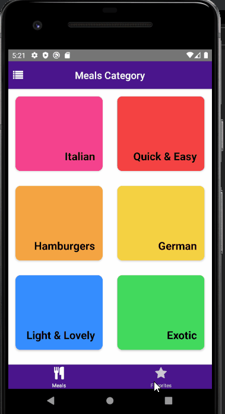

# Meals Finder with React Native

Meals Finder React Native V1.0.0 using CLI ( Work In Progress )

## Overview



## Environment Setup

Please refer to the docs in here [React Native Docs](https://reactnative.dev/docs/environment-setup)

## Step To Install

These are step to install the React Native project

## Install dependencies

```
npm install
```

## Run android

```
npm start
```
